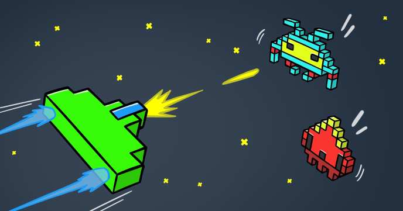

Space Invaders is one of the most well-known classic arcade games. It was released in 1978 in Japan and soon after licensed for use in United States.

This popular game spawn many remakes, sequels as well as clones.

Follow this tutorial to learn how to how to create your own custom clone of this popular game.
 
## Source code 
The JavaScript source code of this program can be found [here](sketches/program.js). To run it, you need to import it in the [codeguppy.com](https://codeguppy.com) online editor. Alternatively, you can use the source code in your p5.js sketches (advanced use). 
## Online version 
To see the code running, check the online playground at [https://codeguppy.com/code.html?t=invaders](https://codeguppy.com/code.html?t=invaders) 
## Next steps 
Please check [codeguppy.com](https://codeguppy.com) for many other fun JavaScript programs and games for beginners. To stay up to date with CodeGuppy development please follow [@codeguppy](https://twitter.com/codeguppy) on Twitter.  
